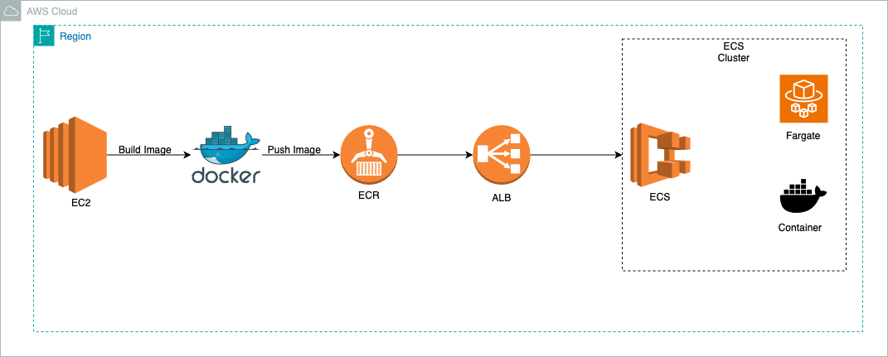

# AWS Microservice ECS Project


----

# Deploy an Application to Amazon ECS With EC2, Docker, ECR, Fargate, and Load Balancer

This repository provides a comprehensive guide to deploying an application using Amazon ECS with EC2, Docker, ECR, Fargate, and a Load Balancer. This deployment setup ensures high availability, scalability, and efficient management of your application.


## Architecture Overview
This project leverages the following AWS services:
- **Amazon EC2**: For initial setup and Docker installation.
- **Amazon ECS (Elastic Container Service)**: For orchestrating Docker containers.
- **Amazon ECR (Elastic Container Registry)**: For storing Docker images.
- **AWS Fargate**: For serverless compute engine for containers.
- **Elastic Load Balancer (ELB)**: For distributing incoming traffic across multiple targets.

## Setup and Deployment

### Launch EC2 Instance and Install Docker
1. **Launch an EC2 Instance**: Start an EC2 instance with Amazon Linux 2.
2. **Install Docker**:
   ```sh
   ssh into your EC2 instance
   curl -fsSL https://get.docker.com -o get-docker.sh
   sudo sh get-docker.sh
   sudo systemctl start docker
   sudo systemctl status docker
   ```

### Build and Run Docker Image
1. **Create a Project Directory**:
   ```sh
   mkdir myproject
   cd myproject
   vim Dockerfile
   vim index.html
   ```
2. **Create `Dockerfile`**:
   ```Dockerfile
   FROM nginx:alpine
   COPY index.html /usr/share/nginx/html/index.html
   ```
3. **Create `index.html`** with some content.
4. **Build the Docker Image**:
   ```sh
   docker build -t project-image .
   ```
5. **Run the Docker Container**:
   ```sh
   docker run -d -p 80:80 --name project-container project-image
   ```

### Create and Push Image to ECR
1. **Create ECR Repository**: Go to ECR in the AWS console, create a repository named `myecr-repo`.
2. **Configure IAM Roles and Policies**: Ensure the EC2 instance has the necessary IAM role with ECR permissions.
3. **Login to ECR**:
   ```sh
   aws ecr get-login-password --region <your-region> | docker login --username AWS --password-stdin <your-account-id>.dkr.ecr.<your-region>.amazonaws.com
   ```
4. **Tag and Push Docker Image**:
   ```sh
   docker tag project-image:latest <your-account-id>.dkr.ecr.<your-region>.amazonaws.com/myecr-repo:latest
   docker push <your-account-id>.dkr.ecr.<your-region>.amazonaws.com/myecr-repo:latest
   ```

### Setup Load Balancer
1. **Create an Application Load Balancer**: Configure it with three availability zones for high availability.
2. **Create a Target Group**: Register your EC2 instances or ECS tasks.
3. **Adjust Health Check Settings**: Set healthy threshold to 2 for faster response.

### Create ECS Task Definition and Service
1. **Create Task Definition**: Use the Fargate launch type, define the container using the ECR image URI.
2. **Create ECS Cluster**: Group your ECS tasks and services.
3. **Create Service**: Attach the Load Balancer to the service for high availability and scalability.

## Accessing the Application
- Use the DNS name of the Application Load Balancer to access your deployed application.

## Conclusion
This setup demonstrates a robust method for deploying containerized applications on AWS, leveraging ECS, ECR, Fargate, and Load Balancers to ensure scalability and high availability.

## Summary
This project showcases how to deploy an application on AWS using a variety of services. By following this guide, you will gain practical experience with Docker, ECS, ECR, Fargate, and Load Balancers, providing a solid foundation for deploying scalable and highly available applications in a production environment.
